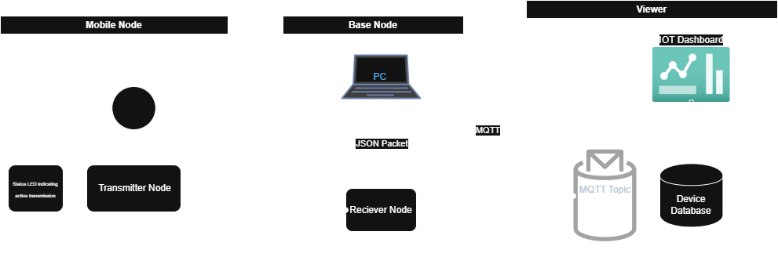
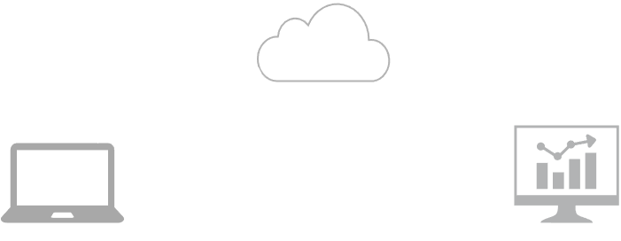

# Apollo-Blue
Apollo Tuna: IOT Guitar Tuner

## Project Description
Explaining the project

## Project Block Diagram

## DIKW Pyramid Abstraction

## System Integration

## Wireless Network Communications
As seen in the project block diagram there will be 3 forms of communications systems: 
1. **UART** Serial connection between the base node and the PC (device monitor).
2. **BLE** Central Peripheral topology with the base node acting as the central device and the mobile node acting as the peripheral device.  
3. **MQTT** MQTT Protocol to send data payloads as JSON packets to be unpacked by the network payload parser defined in the device network integration. 

## Deliverables and Key Performance Indicator
1. **Sensor Node** by Ganesh and Francisco (Due 23rd May 2025) a. Setting up Detector Thread (Due 18th May 2025) b. LED Status Thread (Due 18th May 2025) c. Configure BLE HCI UART Connection (TX) (Due 19th May 2025)

2. **Base Node** by Francisco and Slater (Due 23rd May 2025) a. Configure BLE HCI UART Connection (RX) (Due 19th May 2025) b. Setting Up a Note Detector Thread via a Note Detector ML Model (Due 22nd May 2025) c. Configure Serial Thread that outputs JSON Packets (Due 19th May 2025)
    
3. **Web UI** by Slater (Due 19th May 2025) a. Publishes to a Broker via the MQTT protocol (Due 17th May 2025) b. Device Database Subscribes to Topic (Due 17th May 2025) c. Device Dashboard displays Database (Due 18th May 2025) d. Setting up Dashboard (Due 18th May 2025)