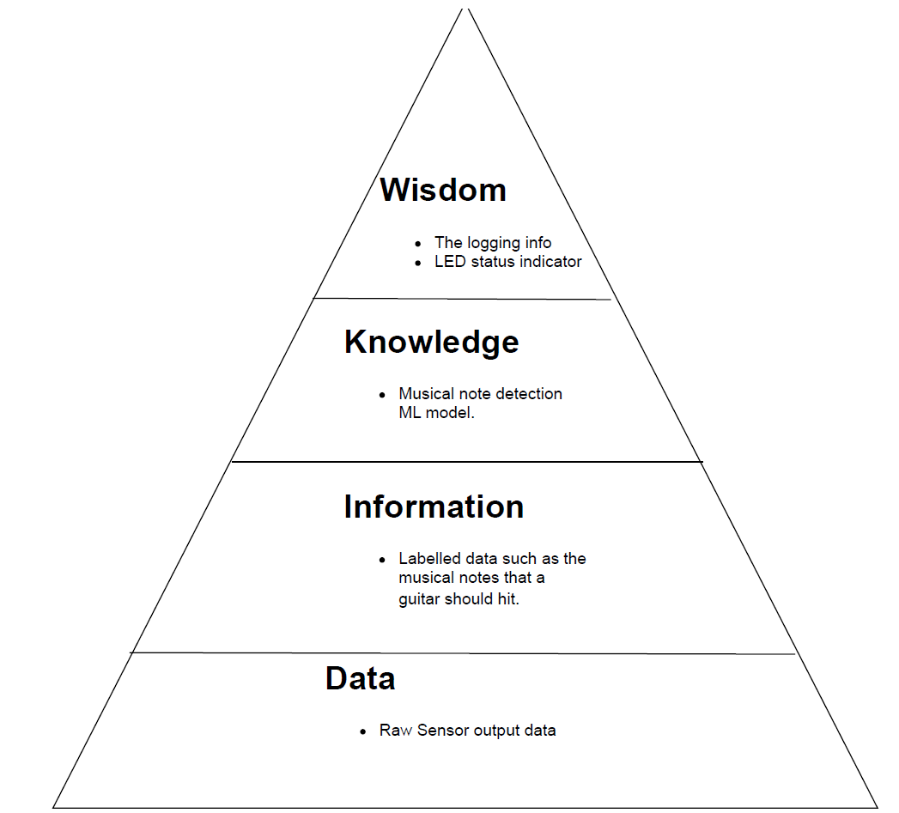

# Apollo-Blue
Apollo Tuna: IOT Guitar Tuner

## Project Description
The Apollo Blue Guitar Tuna (ABGT) will revolutionise the music industry, by deploying an embedded IOT device onto the end of the neck of the guitar. It will gather the audio notes and wirelessly transmit them to a device monitor running a locally trained ML model to seamlessly detect what notes you are playing and all the user has to do is adjust the appropriate chord to fine tune their guitar and helping the new generations Santana.  The network protocol will publish the results of the ML model to a MQTT Topic running on a local serverless broker hosted on EMQX that will then send this payload to the device database. Using TagoIO the device network integration will unpack the payload with a custom payload parser to create a web dashboard to display the results of the Tuna. 

## Project Block Diagram

## DIKW Pyramid Abstraction

## System Integration
The system seen in the project block diagram has 3 types of communications systems and represented in their respective comms method. Referring to the Wireless Network Communications section showing how each comms system is integrated, on the hardware front the "Mobile Node" will be a NRF528DK with a Microphone (Audio Sensor) acting as the peripheral to consistently stream audio data to the "Base Node" running a locally trained Machine Learning Module on Edge Impulse. Finally the results will be serially sent to the Device Monitor i.e the PC as a JSON Packet and in tern sent to the device dashboard as explained in the network architecture diagram.  

## Wireless Network Communications
As seen in the project block diagram there will be 3 forms of communications systems: 
1. **UART** Serial connection between the base node and the PC (device monitor).
2. **BLE** Central Peripheral topology with the base node acting as the central device and the mobile node acting as the peripheral device.  
3. **MQTT** MQTT Protocol to send data payloads as JSON packets to be unpacked by the network payload parser defined in the device network integration. 

## Deliverables and Key Performance Indicator
1. **Sensor Node** by Ganesh and Francisco (Due 23rd May 2025) a. Setting up Detector Thread (Due 18th May 2025) b. LED Status Thread (Due 18th May 2025) c. Configure BLE HCI UART Connection (TX) (Due 19th May 2025)

2. **Base Node** by Francisco and Slater (Due 23rd May 2025) a. Configure BLE HCI UART Connection (RX) (Due 19th May 2025) b. Setting Up a Note Detector Thread via a Note Detector ML Model (Due 22nd May 2025) c. Configure Serial Thread that outputs JSON Packets (Due 19th May 2025)
    
3. **Web UI** by Slater (Due 19th May 2025) a. Publishes to a Broker via the MQTT protocol (Due 17th May 2025) b. Device Database Subscribes to Topic (Due 17th May 2025) c. Device Dashboard displays Database (Due 18th May 2025) d. Setting up Dashboard (Due 18th May 2025)